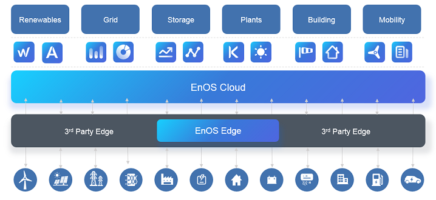

# EnOS 简介

EnOS™是一个集成、安全、开放的智能物联网操作系统，帮助企业和城市加速数字化转型和生态系统建设。EnOS™建立在开放的标准和最佳设计之上，并持续在开放的生态系统中运行。

**设备接入**

基于丰富的通信协议库，支持广泛的设备接入方案：
- EnOS支持通过MQTT协议直连设备，也支持通过EnOS Edge或第三方网关设备连接设备，满足多种业务需求。
- EnOS Edge支持多套行业标准协议和主流IoT供应商的私有协议。EnOS还提供工具集来帮助您开发私有协议。

关于设备接入的详细介绍，请参见 [设备接入概述](https://docs.envisioniot.com/docs/device-connection/zh_CN/latest/deviceconnection_overview.html)。

**灵活部署**

EnOS提供企业级的软件栈，支持灵活的部署方案（公有云、私有云、混合云）。

用户可将EnOS部署在公有云或私有云环境中，无需管理复杂的软件栈，即可开发、运行、维护自有应用。

用户还可以将EnOS部署在公有云环境的虚拟私有云（VPC）或私有云环境中，而不依赖于底层管理程序；也可以根据自身对成本、控制、可配置性、可延展性、地理位置、安全等方便的要求部署最适合的解决方案。

EnOS与大多数主流云服务商兼容，如Amazon AWS和Microsoft Azure。为保持最佳兼容性，EnOS公共集群仅依赖于所选云服务商的虚拟机和NFS服务。大部分EnOS核心物联网组件都是基于最新开源软件开发的，与虚拟机支持的常见操作系统环境完美兼容。EnOS云端与云服务商的管理接口相集成，支持现有集群的扩展和新集群的自动创建。

**专业能力**

EnOS在智能能源设备和业务场景的丰富经验，确定了在专业领域的数据架构能力。

基于大量的专业领域元数据，EnOS支持标准化的数据采集策略、数据采集规则、事件处理规则、数据保存策略、ODS原理、访问控制策略、以及数据质量策略。从数据源到数据目标的可配置元数据映射，显著减少了数据清理和标准化所需的工作。

**生态系统**

EnOS将自有应用与第三方应用无缝集成，提供端到端工具，帮助用户构建自有平台。

物联网工程师、数据科学家、应用开发者可以通过EnOS平台管理设备和模型、开发设备数据、配置事件触发策略、生成数据分析报表、以及通过平台提供的工具开发和管理应用。

<!--Need to add description about the end user, system admins and application users-->

## 产品架构

EnOS由云端（EnOS Cloud）和边缘设备（EnOS Edge）组成，如下图所示：

### EnOS云端

EnOS云端提供基于模型的设备资产管理、数据收集、流式数据处理、批量数据处理、自定义事件触发规则、以及时序数据查询等基础能力。

对于设备接入，EnOS云端支持自有EnOS Edge；如果业务需要，也支持与EnOS设备接入框架兼容的第三方边缘设备。

### EnOS Edge

EnOS Edge提供设备数据收集、设备控制、数据规范化、基于模型的实时计算等能力。EnOS Edge与云端通过TLS/SSL协议进行安全数据通信，每个边缘设备和EnOS Cloud接入点都有专用的X.509证书。
