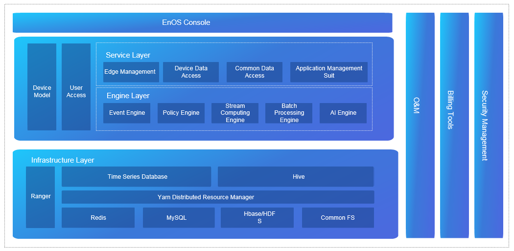

# EnOS技术架构

本文简要介绍EnOS智能物联网操作系统的技术架构。EnOS的架构主要由EnOS Edge层和EnOS云端层组成。
- 设备通过EnOS Edge连接到EnOS云端。设备数据通过支持的通信协议以预设的标准格式上传到EnOS云端。如有需要，EnOS也支持边缘计算。
- EnOS云端通过MQTT协议接收设备数据。数据经过流式计算引擎处理之后，分配到存储集群保存。EnOS云端支持自有EnOS Edge和第三方边缘设备。

## EnOS Edge

EnOS Edge是EnOS平台的数据采集前置，用于采集现场设备数据或者对接第三方系统获取数据，并将数据安全转发到EnOS云端。EnOS Edge与企业资产紧密联系，协助将资产管理、大数据分析等数据与基于云端的服务进行数据交换。然后，数据分析和资产管理命令会回传到设备，用于优化设备性能，或执行关键操作。

-   **Connectivity engine**：提供丰富的行业标准协议库，用户可以配置引擎实现远程设备的数据连接。

-   **Redis**：提供内容数据管理服务。

-   **AMQ message engine**：消息代理中间件，将数据路由到其它核心模块。

-   **Model data management**：存储从云端获取的设备模型数据。

-   **HA engine**：提供高可用性以确保系统弹性。

-   **Cloud access interface**：提供基于云的通信管理服务，包括身份验证、授权、MQTT客户端等。

## EnOS云端

### 基础设施层

EnOS Cloud基础设施层提供整套数据库集群，比如Redis，MySQL，Hbase/HDFS，和Common FS。EnOS Cloud应用Ranger进行数据安全和管理，通过Yarn Distributed Resource Manager提供时序数据管理以及离线SQL数据管理。

在这些系统组件中，除了时序数据库（TSDB）由远景自行开发，其余皆为领先的大型数据系统的开放源代码。

- **Envision-developed TSDB**：结合Hive，确保高响应性和大数据量的离线存储。

- **Ranger**：确保数据管理的安全性。

- **Yarn**：提供资源调度能力。

其它开源组件充当基础数据存储系统。其中，Common FS封装公共文件服务并保护数据不受宿主环境的影响。
- **Redis**：存储从设备端传输的数据快照，使实时遥测数据立即可访问。

- **Mongo DB**：存储接入EnOS Cloud的设备主数据。例如，风场的资产数据以JSON数组格式存储于Mango DB。

- **MySQL**：在设备库中存储设备模型和数据实例数据。这里数据变化较少，并且数量相对较少。

- **HBase**：大数据量时序数据库。

- **HDFS**：存储所有历史数据，主要目的是通过Hadoop集群优化批量数据处理。

- **ELK (elasticsearch，logstash，kibanna)**：收集、查询、显示日志，支持日志数据的高级查询。

### 核心引擎层

EnOS核心引擎层提供如下引擎：

-   **Event engine**：提供事件告警服务，通过超阈值、复杂规则组合等事件触发规则获取设备异常信息。

-   **Rule engine**：类似于物联网中心，依据配置的规则，将数据分派给不同的引擎作进一步处理。

-   **Stream computing and batch job process engines**：提供核心计算能力，并能满足应用程序的定制计算和数据存储需求。

-   **AI engine**：机器学习专用引擎。

核心引擎层助力通过服务层进行的应用程序开发。

### 服务层

对服务层各个服务模块的介绍如下：

-   **Edge management service**：支持边缘计算设备的全生命周期管理，提供设备的连接和状态监控服务。

-   **Device data access service**：通过API和SDK对数据访问点和计算点进行双向访问，提供数据采集服务。

-   **Common Data Service**：提供物联网行业中的常见公共数据服务，如天气、电价等。

-   **Application management suite**：提供应用管理和调试工具集，如访问控制、系统隔离等。

### 设备模型和用户权限模块

EnOS核心引擎层和服务层通过用户权限和设备模型模块提供外部服务。

设备模型模块本质是一个设备信息数据库，为接入EnOS的设备提供描述信息，使新设备的接入更高效。

用户权限模块提供资产所有者账号和应用账号管理，提供从资产到应用程序的身份验证和授权。

### EnOS控制台与API层

EnOS控制台与API层是EnOS的可扩展访问接口。除EnOS的核心功能之外，这个接口层还可以扩展以支持第三方应用程序和工具。
