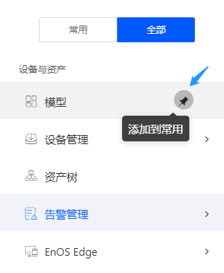

# EnOS控制台GUI使用惯例

该文档介绍了基于图形界面的EnOS Console的通用组件及交互行为。

## 收藏常用的服务菜单

在EnOS Console中的任何位置，你都可以通过点击左上角的 |menu| 进入服务菜单栏。根据你的访问权限，导航菜单将显示所有你被授权访问的服务，你可以根据你的使用习惯将常用的菜单项收藏到 **常用** 标签。反之，当服务变得不常用时，你也可以将菜单项从 **常用** 中移除。

.. |menu| image:: media/menu_icon.png

## 名称的国际化设置 - *国际化组件*

为了便于不同语言的人围绕EnOS进行协作，以及应用被不同语言的用户使用，EnOS为名称类字段的填写提供了*国际化组件*，下图为一个该组件的示例：

### 字段信息填写

.. |i18n| image:: media/button_i18n.png

- 如果未点击 |i18n| 进入国际化信息填写，当前输入框中的值将成为该名称的默认值，即无论在任何语言下，名称都会显示该默认值。

- 如果点击 |i18n| 进入 **国际化** 弹窗：

  

  你可以在这里输入
  - **默认（Default）**：如果你没有输入**英语（en-US）**和**中文（zh-CN）**，将在所有语言的环境下显示该名称。
  - **英语（en-US）**: 如果你输入了英文名称，则将在英文环境中显示该英文名称。
  - **中文（zh-CN）**：如果你输入了中文名称，则将在中文环境中显示该中文名称。

### 基于国际化组件的搜索行为

- 如果产品名称通过国际化组件设置不同语言环境中的名称，则在对应语言环境中搜索匹配对应的名称值，即在英文环境中搜索英文，中文环境中搜索中文。

- 如果产品名称的国际化组件中没有设置对应不同语言的，则搜索国际化组件中的默认值。

