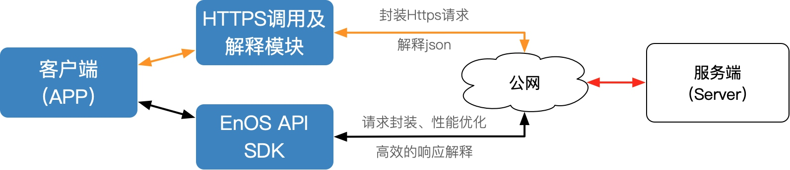

# EnOS API调用指南
EnOS系统向合作伙伴开放涵盖系统各个核心业务流程的REST API接口。基于这些接口，开发者可以向自己的用户提供各类应用，支持智能设备接入、数据获取、数据存储、数据挖掘、数据可视化等业务场景。

EnOS REST API是基于HTTP协议来调用的。开发者可以直接使用系统提供的官方SDK（支持java语言，包含了请求的封装，签名加密，响应解释，性能优化等）来调用，也可以根据约定的协议来封装HTTP请求进行调用。

- **使用EnOS API SDK**: EnOS系统提供的官方SDK支持java语言，包含了请求的封装，签名加密，响应解释，性能优化等功能，只需很少的编程工作，就可方便地调用EnOS API。使用EnOS API SDK的详细步骤，请参考[使用EnOS API SDK](https://docs.envisioniot.com/docs/enos-tutorials/en/latest/application_development/try/module_5.html). 
- **手动封装HTTP请求**: 如果不使用EnOS API SDK，也可以根据约定的协议来封装HTTP请求调用API。

 以下是大致的API调用过程示意图：




## 封装HTTP请求调用API

以下是针对自行封装HTTP请求进行API调用的流程解释。主要流程如下：填充参数 > 生成签名 > 拼装HTTP请求 > 发起HTTP请求> 得到HTTP响应 > 解释JSON结果。

封装HTTP请求进行API调用实际是通过手动方式或API调用工具构造REST API的URL，并通过URL访问EnOS API。 构造API URL需要的信息包括：

1. EnOS API的网关地址 （服务URL）：`` https://enos-api-cn1.envisioniot.com/ ``
2. 调用方法：EnOS API的请求方法，例如GET，POST，PUT，DELETE 
3. API URL：每个EnOS API的URL，详见API参考文档
4. 请求参数：包括拼接在URL中的query请求参数以及JSON格式的body请求参数 

### 公共参数

调用EnOS API需要传入的公共请求参数包括：

<table> 
  <tr> 
    <td>参数名称</td> 
    <td>参数类型</td> 
    <td>是否必须</td> 
    <td>参数描述</td> 
  </tr> 
  <tr> 
    <td>accessKey</td> 
    <td>String</td> 
    <td>是</td> 
    <td>服务账号的accessKey，通过创建应用生成</td>
  </tr> 
  <tr> 
    <td>secretKey</td> 
    <td>String</td> 
    <td>是</td> 
    <td>服务账号的secretKey，通过创建应用生成</td>
  </tr> 
  <tr> 
    <td>requestTimestamp</td> 
    <td>String</td> 
    <td>是</td> 
    <td>Unix时间戳，是指从格林威治时间1970年01月01日00时00分00秒(北京时间1970年01月01日08时00分00秒)起至现在的总秒数。</td>
  </tr> 
  <tr> 
    <td>sign</td> 
    <td>String</td> 
    <td>是</td> 
    <td>API输入参数签名结果，签名算法参照下面的介绍。</td>
  </tr>
</table>

### 业务参数
API调用除了必须包含公共参数外，如果API本身有业务级的参数也必须传入，每个API的业务级参数请考API文档说明。
### 签名算法
为了防止API调用过程中被恶意篡改或盗用，开发者需要根据accessKey、secretKey以及请求参数生成签名。服务端会对签名进行验证，签名不合法的请求将会被拒绝。目前支持采用的签名方法为SHA-1。

**算法说明**
- 对URL参数（包括requestTimestamp）和application/x-www-form-urlencoded类型的表单参数进行字典升序排列。

- 将以上排序后的参数表进行字符串连接，如key1value1key2value2key3value3...keyNvalueN。

- 如果请求带有JSON类型的body，把整个body当做字符串拼接到上一步的字符串后面。

- 将accessKey作为前缀，将secretKey作为后缀，对该字符串采用utf-8编码，使用签名算法对编码后的字节流进行摘要，并转换成16进制编码。

**JAVA生成签名示例**
```java
// 定义appKey和appSecret
        String accessKey = "eos_test_appkey";
        String secretKey = "eos_test_secret";
        String apiUrl = "http://xxx.envisioniot.com/enosapi";

// 参数表
        Map<String, String> paramMap = new HashMap();
        paramMap.put("mdmids", "67c17f7cebd44323b764e853394af5e8%2C70106f0c458e4b3994e741670d6be659");
        paramMap.put("points", "INV.GenActivePW%2CINV.APProduction");
        paramMap.put("time_group", "D");

// 对参数名进行字典排序
        String[] keyArray = paramMap.keySet().toArray(new String[0]);
        Arrays.sort(keyArray);

// 拼接有序的参数名-值串
        StringBuilder stringBuilder = new StringBuilder();
        stringBuilder.append(accessKey);
        for (String key : keyArray)
        {
            stringBuilder.append(key).append(paramMap.get(key));
        }
        stringBuilder.append(secretKey);
        String codes = stringBuilder.toString();

// 上述参数/AppKey/AppSecret拼接后字符串连接示例：
// eos_test_appkeymdmids67c17f7cebd44323b764e853394af5e8%2C70106f0c458e4b3994e741670d6be659pointsINV.GenActivePW%2CINV.APProductiontime_groupDeos_test_secret

// 此处采用SHA-1签名方法并转换为大写
        String sign = org.apache.commons.codec.digest.DigestUtils.shaHex(codes).toUpperCase();

//签名结果
//2D87E22205279651B59AD96AAEC102464374734F
```
**注意:**
若访问API过程中出现"signature verification failed"错误提示，常见原因如下：

1. App Key与App Secret不匹配
2. 签名方法有误
3. 生成sign签名时，中文的参数值没有先转换为UTF8编码

### 拼装HTTP请求（调用示例）
以connectService中getProduct调用为例，拼装HTTP请求的具体步骤如下：

**1. 设置参数值**

公共参数：

requestTimestamp = 1536560363020

业务参数：

orgId = "123"
productKey = "12345"

**2. 将参数按ASCII顺序排序**
orgId = "123"
productKey = "12345"
requestTimestamp = "1536560363020"

**3. 拼接参数名与参数值**
```java
orgId123productKey12345requestTimestamp1536560363020
```
**4. 生成签名**

假设accessKey和secretKey分别为"accessKeyExample"和"secretKeyExample"，则签名结果为：hex(md5(accessKeyExample+orgId123productKey12345requestTimestamp1536560363020+secretKeyExample)) = "4A6936C442CC34C5C42B9E06D97F2FA268B7E52F"

**5. 拼装HTTP请求**

将所有参数名和参数值采用utf-8进行URL编码（参数顺序可随意，但必须要包括签名参数），然后通过GET或POST（含byte[]类型参数）发起请求，如：
```
http://xxx.envisioniot.com/enosapi/connectService/products/12345?orgId=123&productKey=12345&requestTimestamp=1536560363020&accessKey=accessKeyExample&secretKey=secretKeyExample&sign=4A6936C442CC34C5C42B9E06D97F2FA268B7E52F
```
**注意事项**

- 所有的请求和响应数据编码皆为utf-8格式，URL里的所有参数名和参数值请做URL编码。如果请求的Content-Type是application/x-www-form-urlencoded，则HTTP body体里的所有参数值也做URL编码；如果是multipart/form-data格式，每个表单字段的参数值无需编码，但每个表单字段的charset部分需要指定为utf-8；如果是applincation/json，则整个HTTP body作为字符串参与签名，但不需要进行URL编码。
- 生成签名（sign）仅对未使用官方SDK进行API调用时需要操作，如使用了官方SDK，该步骤SDK会自动完成。

### 解释JSON返回结果

API调用成功之后，调用结果以JSON格式返回。
