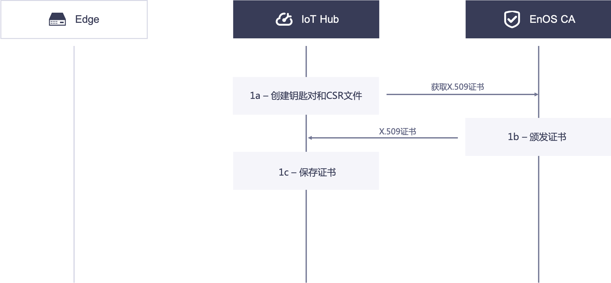

# Best practice for securing communications between edge gateways and EnOS IoT Hub with X.509 certificates

Security is a critical in an IoT system. EnOS enforces the following security schemes for secure the connection between the edge gateway and EnOS IoT Hub:

- The communications between the edge gateway and EnOS IoT Hub are enfored to use certificate-based bi-directional authentication.
- Support for RSA algorithm to verify signature, with enforcement for 2048 bits.
- The resource on EnOS is segregated and the API access permissions are controlled by IAM, for more information, see [IAM overview](https://docs.envisioniot.com/docs/iam/en/latest/iam_overview.html).

## Setup phase

The following diagram illustrates the process of secure communication between the edge and IoT Hub based on X.509 certificates:

### 1. IoT Hub acquires X.509 certificate

1a. The IoT Hub creates key pairs and CSR locally, acquires the X.509 certificate with the CSR by using the X.509 Certificate Service API.

1b. The EnOS CA issues the X.509 certificate and sends the certificate to the IoT Hub.

1c. The IoT Hub receives and stores the X.509 certificate.

### 2. Edge acquires X.509 certificate

2a. *The device provisioner* provisons the edge with neccesary information such as product key, product secret, serial number, and license. The provisioner uses these parameters to create the device in the IoT Hub.

2b. The IoT Hub verifies the identity of the edge and creates the device instance in the Hub, responds to Edge with the Globally Unique Identifier (GUID) of the device and the device secret.

2c. The edge receives the responses from the IoT Hub, creates key pairs and CSR, calls the API to activate the device, and gets its X.509 certificate.

2d. The IoT Hub receives the request from the edge, after verifing its identity, activates the device and forward the CSR to the EnOS CA.

2e. The EnOS CA receives the CSR, issues the certificate and responds to the IoT Hub.

2f. The IoT Hub receives the issued X.509 certificate, binds it with the device id, and then sends the certificate to the edge.

2g.The edge receives the issued X.509 certificate, saves it securely in the local repository.

## Communication phase

The diagram below illustrates the certificate-basd authentication process and the revocation process:

### 3. Edge commmunicates with the IoT Hub using the certificate-based bi-directional authentication

3a. The edge validates the certificate of the IoT Hub.

3b. The IoT Hub validates the certificate of the edge.

When the TLS handshake in step 3a and 3b succeeds, the TLS connection is established between the edge and the IoT Hub.

3c. The edge transmits device telemetry through MQTT over the TLS connection.

3d. The IoT Hub transmits configurations and control signals through MQTT over the TLS connection.

## Revocation phase

Under some circumstances, the *device provisioner* needs to revoke the X.509 certificate of the edge.

### 4. The IoT Hub revokes the X.509 certificate of the Edge

4a. The IoT Hub calls the revocation API to revoke the X.509 certificate with the serial number of the certificate.

4b. The EnOS CA receives the request from the IoT Hub, verifies the identity, revokes the certificate, and update the CRL.

## Edge security best practices

In the certificate-based security connection, consider the following best practices to secure the edge:

- Create the private key for the edge and keep it secret in a storage such as TPM.
- Use TLS 1.2 when communicating with the IoT Hub, and verify that the server certificate is valid.
- Each edge must have a unique public/private key pair.
- The key pair used to be authenticated by IoT Hub should not be used for other purposes or communications through other protocols.
- The key must be revoked when the edge is reset.
- When your edge runs on an operating system, make sure your operating system is secured through certain machanisms, for example, firewall.
- Ensure that you have a way to update root CA certificates and CRL.
- Ensure that the clock on the edge is not tampered with.
